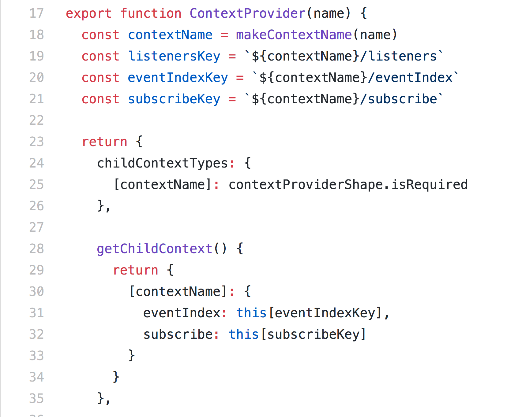

## Compare Routing

#### ichi

---

@title[Introduction]

### Introduction

+++

---

* Routing Table
* Rendering
  * server, client
* Navigation Actions

---

### Next.js vs. Rails

---?code=codes/next-routing-table.js&title=Next.js - Routing Table

@title[Next.js]

@[3-4](defined routing)

+++?code=codes/next-render-server.js&title=Next.js - Server

@[2](import routing table)
@[6-10](listen with express)

+++?code=codes/next-render-client.js&title=Next.js - Client

@[2](use Link defined from routing table)
@[4-8](render the Component)

+++?code=codes/next-actions.js&title=Next.js - Navigation Actions

@[2](import Router from routing table)
@[6-9](use [router api](https://github.com/fridays/next-routes#router-example))
@[12-14](history.back or use Link Componet)

---?code=codes/rails-routing-table.rb&title=Rails - Routing Table

@title[Rails]

@[4-11](define routes, will call action of controller)

+++?code=codes/rails-controller.rb&title=Rails - Controller and Actions

@[17-40](use destroy as an example)
@[21](define format)
@[25](go to users#index and change url)
@[28](render users#edit but not change url)

+++?code=codes/rails-link-to.html.erb&title=Rails - helpers

@[1-11](use link_to)

+++?code=codes/rails-button-to.html.erb&title=Rails - helpers

@[1-15](use button_to)

---

### Experimental vs. React-Navigation

---?code=codes/exp-component.js&title=Experimental - Routing Table

@[1](define enterance Component)
@[70-76](use Experimental)
@[45-53](header definition)
@[2-15](right header definition)
@[17-29](left header definition)
@[31-43](center header definition)
@[55-68](content definition)

+++?code=codes/exp-actions.js&title=Experimental - Routing Actions

@[2-4](import utils)
@[18](call function)
@[21](call function)

+++

### Design Pattern of Experimental

* [NavigationCard.js](https://github.com/aksonov/react-native-experimental-navigation/blob/master/NavigationCard.js)
* https://en.wikipedia.org/wiki/Proxy_pattern

---?code=codes/nav-component.js&title=React-Navigation - Routing Table

@[1](define enterance Component)
@[28-30](use React-Navigation)
@[2-25](define all screen)

+++?code=codes/nav-actions.js&title=React-Navigation - Routing Actions

@[1](import utils)
@[3-8](dispatch and call function)

+++

### Design Pattern of React-Navigation

* [StackViewLayout](https://github.com/react-navigation/react-navigation/blob/master/src/views/StackView/StackViewLayout.js)

+++

* [StackRouter.js](https://github.com/react-navigation/react-navigation/blob/master/src/routers/StackRouter.js)
* https://en.wikipedia.org/wiki/Facade_pattern

---
 
### React-Router v3 vs. v4

---?code=codes/v3-routing-table.js&title=React-Router v3 - Routing Table

@title[React-Router v3]

+++?code=codes/v3-v4-Link.js&title=React-Router v3 - Link

+++?code=codes/v3-client.js&title=React-Router v3 - Client

+++?code=codes/v3-server.js&title=React-Router v3 - Server

+++

@div[left-80]

@divend

@div[right-20]
  @ul
    * [ContextUtils.js](https://github.com/ReactTraining/react-router/blob/v3/modules/ContextUtils.js)
  @ulend
@divend

+++

@div[left-80]

@divend

@div[right-20]
  @ul
    * [RouterContext.js](https://github.com/ReactTraining/react-router/blob/v3/modules/RouterContext.js)
  @ulend
@divend

---?code=codes/v4-routing-tble.js&title=React-Router v4 - Routing Table

@title[React-Router v4]

+++?code=codes/v4-routing-table.js&title=React-Router v4 - Routing Table

+++?code=codes/v3-v4-Link.js&title=React-Router v4 - Link

+++?code=codes/v4-client.js&title=React-Router v4 - Client

+++?code=codes/v4-config.js&title=React-Router v4 - Config

+++?code=codes/v4-server.js&title=React-Router v4 - Server

+++

@div[left-80]

@divend

@div[right-20]
  @ul
    * [Router.js](https://github.com/ReactTraining/react-router/blob/master/packages/react-router/modules/Router.js)
  @ulend
@divend

+++

@div[left-80]

@divend

@div[right-20]
  @ul
    * [Router.js](https://github.com/ReactTraining/react-router/blob/master/packages/react-router/modules/Router.js)
  @ulend
@divend

+++

@div[left-80]

@divend

@div[right-20]
  @ul
    * [BrowserRouter.js](https://github.com/ReactTraining/react-router/blob/master/packages/react-router-dom/modules/BrowserRouter.js)
  @ulend
@divend

+++

@div[left-80]

@divend

@div[right-20]
  @ul
    * [StackRouter.js](https://github.com/ReactTraining/react-router/blob/master/packages/react-router/modules/StaticRouter.js)
  @ulend
@divend

---

@title[React-Native-Web]

### React-Native-Web

+++

###  React-Router vs. React-Navigation

+++

### React-Navigation

* createStackNavigator, createTabbarNavigator, createDrawerNavigator...

* pass parameters
  * this.props.navigation.navigate(routename, params)

* use dispatch navigation actions

+++

### React-Router

* Client and Server
  * BrowserRouter
  * match, http server

* pass parameters
  * pass by query of url
  * by Component

* history

+++

### Bind history at react-navigation

* [react-navigation-web sample code](https://github.com/react-navigation/react-navigation-web/blob/master/src/react-navigation-web.js)
* dispatch
  * history.push
* history.listen
  * dispatch

+++

* wrapper browser history for react-navigation？
* native, server, client
* browser go back vs. customize go back
* code splitting？
