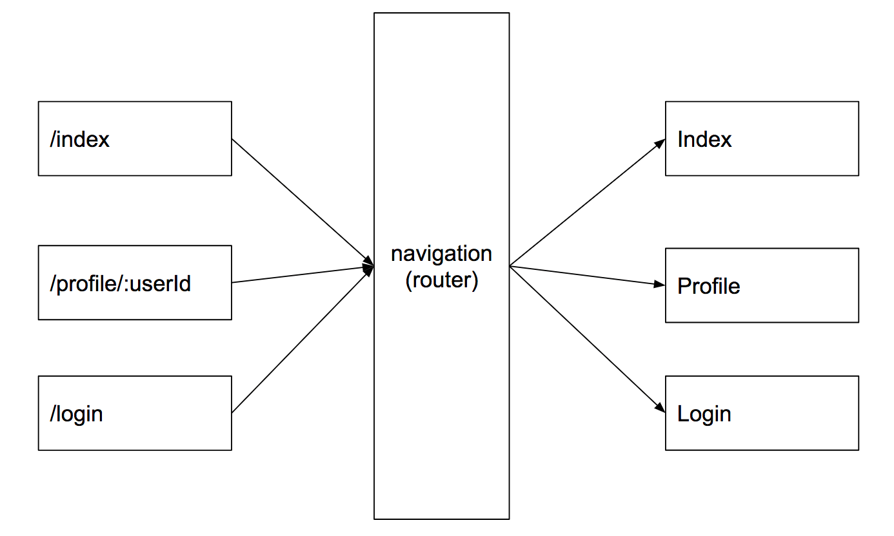
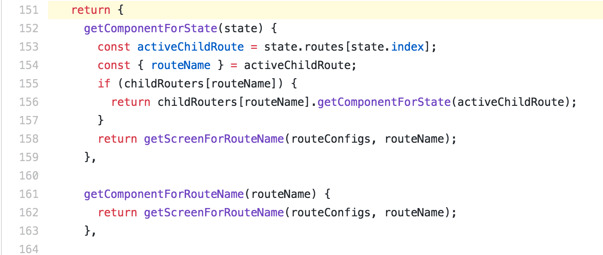
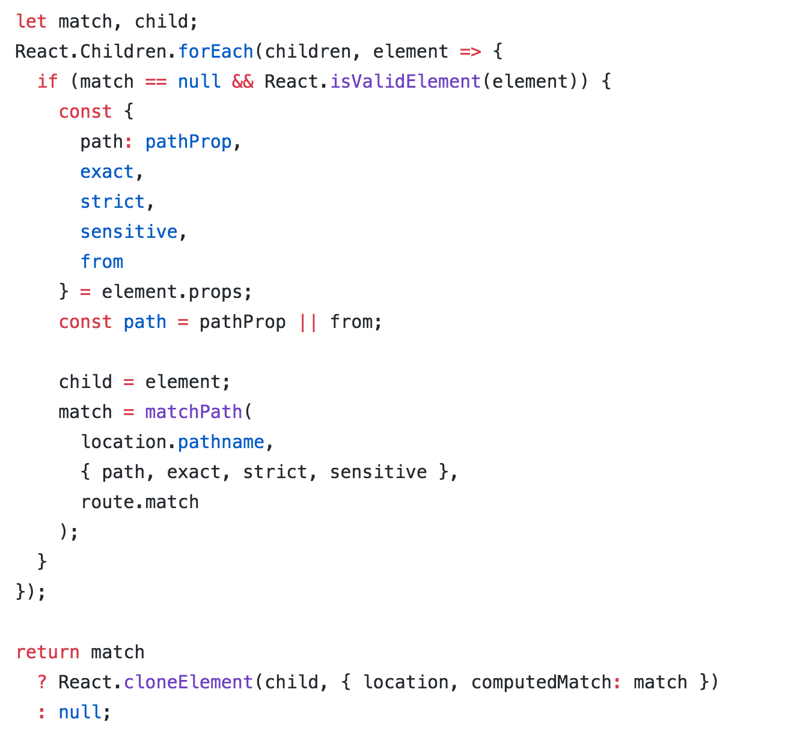

<!-- _class: cover-slide -->
# Compare Routing

### ichi (2018.08)

---

## Introduction



---

## Introduction


---

## Introduction

* Routing Table
* Rendering
  * server, client
* Navigation Actions

---

<!-- _class: cover-slide -->
## Next.js vs. Rails

---

<!-- speaker comment

@[3-4](defined routing)
-->

## Next.js - routing table

```js code=codes/next-routing-table.js
const routes = require('next-routes')();

routes.add('index', '/', 'IndexPage');
routes.add('user', '/users/:username', 'UserPage');
```

<!-- speaker comment
@[3-4](defined routing)
-->

---

## Next.js - Server

```js code=codes/next-render-server.js
const next = require('next');
const routes = require('./next-routing-table');
const app = next({ dir: './src', dev: isDev });
const handle = routes.getRequestHandler(app);

// With express
const express = require('express')
app.prepare().then(() => {
  express().use(handler).listen(3000)
})
```

<!-- speaker comment
@[2](import routing table)
@[6-10](listen with express)
-->

---

## Next.js - Client

```js code=codes/next-render-client.js
// pages/index.js
import React from 'react'
import Link from 'next/link'

export default () => (
  <Link href={{ pathname: index }}>
    <a>Hello world</a>
  </Link>
)
```

<!-- speaker comment
@[2](use Link defined from routing table)
@[4-8](render the Component)
-->

---

## Next.js - Navigation on Actions

```js code=codes/next-actions.js
import React from 'react'
import Router from 'next/router';

export default class Blog extends React.Component {
  onClickUser() {
    // With route name and params
    Router.push('user', {username: 'hello-world'});
    // With route URL
    // Router.push('/users/hello-world');
  }

  onClickBack() {
    window.history.back();
  }

  render () {
    ...
  }
}
```

<!-- speaker comment
@[2](import Router from routing table)
@[6-9](use [router api](https://github.com/fridays/next-routes#router-example))
@[12-14](history.back or use Link Componet)
-->

---

## Rails - Routing Table

```rb code=codes/rails-routing-table.rb

# in config/routes.rb

Rails.application.routes.draw do
  resources :users do
    get 'users', to: 'users#index'
    get 'users/:username', to: 'users#show'
    post 'users', to: 'users#create'
    get 'users/:username/edit', to: 'users#edit'
    patch 'users', to: 'users#update'
    delete 'users/:username', to: 'users#destroy'
  end
end
```

<!-- speaker comment
@[4-11](define routes, will call action of controller)
-->

---

## Rails - Controller and Actions

```rb code=codes/rails-controller.rb
class UsersController < ApplicationController
  ...

  def destroy
    @user = User.find(params[:username])
    ok = @user.destroy

    respond_to do |format|
      format.html {
        if ok
          flash[:notice] = "Delete Success."
          redirect_to :action => 'index'
        else
          flash[:notice] = "Delete Fail."
          render :action => 'edit'
        end
      }
      format.json {
        if ok
          render json => { :status => 200 }.to_json
        else
          render json => { :status => 500 }.to_json
        end
      }
    end

  end
end
```

<!-- speaker comment
@[17-40](use destroy as an example)
@[21](define format)
@[25](go to users#index and change url)
@[28](render users#edit but not change url)
-->

---

## Rails - helpers

```erb code=codes/rails-link-to.html.erb
<%= link_to user_path(@user) do %>
  <%= user.username %>
<% end %>
<!--
  <a href="/users/1">hello-user</a>
-->

<%= link_to 'index', users_path  %>
<!--
  <a href="/users">index</a>
-->
```

<!-- speaker comment
@[1-11](use link_to)
-->

---

## Rails - helpers

```erb code=codes/rails-button-to.html.erb
<%= button_to 'new', new_users_path %>
<!--
  <form method="post" action="/users/new" class="button_to">
    <input value="New" type="submit" />
  </form>
-->

<%= button_to 'destroy', user_path(@user), method: :delete, data: { confirm: 'Are you sure?' } %>
<!--
  <form method="post" action="/users/delete/1" class="button_to">
    <input type="hidden" name="_method" value="delete" />
    <input data-confirm='Are you sure?' value="destory" type="submit" />
    <input name="authenticity_token" type="hidden" value="......."/>
  </form>
-->
```

<!-- speaker comment
@[1-15](use button_to)
-->

---

<!-- _class: cover-slide -->
## Experimental vs. React-Navigation

---

## Experimental - Routing Table

```js code=codes/exp-component.js
export class App from Component {
  _renderRightComponent = (sceneProps) => { ... }

  _renderLeftComponent = (sceneProps) => { ... }

  _renderTitleComponent = (sceneProps) => { ... }

  _renderHeader = () => {
    return (
      <NavigationHeader
        renderRightComponent={this._renderRightComponent}
        renderLeftComponent={this._renderLeftComponent}
        renderTitleComponent={this._renderTitleComponent}
      />
    );
  }

  _renderScene = ({ scene }) => { ... }

  render() {
    return (
      <NavigationCardStack
        renderHeader={this._renderHeader}
        renderScene={this._renderScene}
      />
    );
  }
}
```

<!-- speaker comment
@[1](define enterance Component)
@[70-76](use Experimental)
@[45-53](header definition)
@[2-15](right header definition)
@[17-29](left header definition)
@[31-43](center header definition)
@[55-68](content definition)
-->

---

## Experimental - Routing Actions

```js code=codes/exp-actions.js
import { NavigationExperimental } from 'react-native'
const {
  StateUtils: NavigationStateUtils
} = NavigationExperimental

const initialState = {...}

function navigationState (state = initialState, action) {
  switch (action.type) {
    case 'PUSH_ROUTE':
      return NavigationStateUtils.push(state, action.route);

    case 'POP_ROUTE':
      return NavigationStateUtils.pop(state)
    default:
      return state;
  }
}

export default navigationState;
```

<!-- speaker comment
@[2-4](import utils)
@[18](call function)
@[21](call function)
-->

---

## Design Pattern of Experimental


* [NavigationCard.js](https://github.com/aksonov/react-native-experimental-navigation/blob/master/NavigationCard.js)
* https://en.wikipedia.org/wiki/Proxy_pattern

---

## React-Navigation - Routing Table

```js code=codes/nav-component.js&title=
const RootStack = createStackNavigator(
  {
    Index: {
      screen: IndexScreen,
      navigationOptions: {
        title: 'Index',
      },
    },
    Profile: { ... },
    NotFound: { ... },
  },
  {
    initialRouteName: 'Index',
  }
);


export function App() {
  return <RootStack />;
}
```

<!-- speaker comment
@[1](define enterance Component)
@[28-30](use React-Navigation)
@[2-25](define all screen)
-->

---

## React-Navigation - Routing Actions

```js code=codes/nav-actions.js
import { NavigationActions } from 'react-navigation';

const navigateAction = NavigationActions.navigate({
  routeName: 'Users',
  params: { username: 'hello-user' },
});

this.props.navigation.dispatch(navigateAction);
```

<!-- speaker comment
@[1](import utils)
@[3-8](dispatch and call function)
-->

---

## Design Pattern of React-Navigation


* [StackViewLayout](https://github.com/react-navigation/react-navigation/blob/master/src/views/StackView/StackViewLayout.js)

---



* [StackRouter.js center](https://github.com/react-navigation/react-navigation/blob/master/src/routers/StackRouter.js)
* https://en.wikipedia.org/wiki/Facade_pattern

---
 
<!-- _class: cover-slide -->
## React-Router v3 vs. v4

---

## React-Router v3 - Routing Table

```js code=codes/v3-routing-table.js
export default () => (
  <Router>
    <Route path="/" component={App}>
      <IndexRoute component={Index} />
      <Route path="users" component={UsersIndex}>
        <Route path="/users/:username" component={User} />
      </Route>
    </Route>
  </Router>
);
```

---

## React-Router v3 - Link

```js code=codes/v3-v4-Link.js
import React from 'react'
import { Link } from 'react-router'

export default function UsersIndex({ users }) {
  return (
    <div>
      <h1>Users</h1>
      <ul>
        {users.map(user => (
          <li key={`user-${user.username}`}>
            <Link to={`/users/${user.username}`}>
              {user.username}
            </Link>
          </li>
        ))}
      </ul>
      {this.props.children}
    </div>
  );
}
```

---

## React-Router v3 - Client

```js code=codes/v3-client.js
import React from 'react';
import { render } from 'react-dom';
import { Router, browserHistory } from 'react-router';
import routes from './modules/v3-routing-table';

render(
  <Router routes={routes} history={browserHistory}/>,
  document.getElementById('app')
)
```

---

## React-Router v3 - Server

```js code=codes/v3-server.js
import { renderToString } from 'react-dom/server'
import { match, RoutingContext } from 'react-router'
import routes from './routes'

serve((req, res) => {
  match({ routes, location: req.url }, (error, redirectLocation, renderProps) => {
    if (error) {
      res.send(500, error.message)
    } else if (redirectLocation) {
      res.redirect(302, redirectLocation.pathname + redirectLocation.search)
    } else if (renderProps) {
      res.send(200, renderToString(<RoutingContext {...renderProps} />))
    } else {
      res.send(404, 'Not found')
    }
  })
})
```

---

## React-Router v3 Context Provider

<div class="split-slide">
  <div class="left">
    
  </div>

  <div class="right">
    <ul>
      <li>
        <a href="https://github.com/ReactTraining/react-router/blob/v3/modules/ContextUtils.js">ContextUtils.js</a>
      </li>
    </ul>
  </div>
</div>

---

## React-Router v3 Mixin

<div class="split-slide">
  <div class="left">
    
  </div>

  <div class="right">
    <ul>
      <li>
        <a href="https://github.com/ReactTraining/react-router/blob/v3/modules/RouterContext.js">RouterContext.js</a>
      </li>
    </ul>
  </div>
</div>

---

## React-Router v4 - Routing Table

```js code=codes/v4-routing-table.js
export default function Routes() {
  <Route path="/" component={App}>
    <Switch>
      <Route exact path="/users" component={UsersIndex} />
      <Route path="/users/:username" component={User} />
      <Route path="*" component={NotFound} status={404} />
    </Switch>
  </Route>
}
```

---

## React-Router v4 - Routing Table

```js code=codes/v4-routing-table.js
export default function Routes() {
  <Route path="/" component={App}>
    <Switch>
      <Route exact path="/users" component={UsersIndex} />
      <Route path="/users/:username" component={User} />
      <Route path="*" component={NotFound} status={404} />
    </Switch>
  </Route>
}
```

---

## React-Router v4 - Link

```js code=codes/v3-v4-Link.js
import React from 'react'
import { Link } from 'react-router'

export default function UsersIndex({ users }) {
  return (
    <div>
      <h1>Users</h1>
      <ul>
        {users.map(user => (
          <li key={`user-${user.username}`}>
            <Link to={`/users/${user.username}`}>
              {user.username}
            </Link>
          </li>
        ))}
      </ul>
      {this.props.children}
    </div>
  );
}
```

---

## React-Router v4 - Client

```js code=codes/v4-client.js
import { hydrate as ReactDOMHydrate } from 'react-dom';
import { BrowserRouter } from 'react-router-dom'

ReactDOMHydrate(
  <BrowserRouter>
    <App />
  </BrowserRouter>,
  document.getElementById('app')
);
```

---

## React-Router v4 - Config

```js code=codes/v4-config.js
const routes = [
  {
    component: App,
    routes: [
      {
        path: '/users',
        component: UsersIndex,
      },
      {
        path: '/users/:username',
        component: User,
      },
      {
        path: '*',
        component: NotFound,
      },
    ],
  },
];

export default routes
```

---

## React-Router v4 - Server

```js code=codes/v4-server.js
import { createServer } from 'http'
import React from 'react'
import ReactDOMServer from 'react-dom/server'
import { StaticRouter } from 'react-router'

createServer((req, res) => {

  // This context object contains the results of the render
  const context = {}

  const html = ReactDOMServer.renderToString(
    <StaticRouter location={req.url} context={context}>
      <App/>
    </StaticRouter>
  )

  // context.url will contain the URL to redirect to if a <Redirect> was used
  if (context.url) {
    res.writeHead(302, {
      Location: context.url
    })
    res.end()
  } else {
    res.write(html)
    res.end()
  }
}).listen(3000)
```

---

## React Router v4 Context

<div class="split-slide">
  <div class="left">
    
  </div>

  <div class="right">
    <ul>
      <li>
        <a href="https://github.com/ReactTraining/react-router/blob/master/packages/react-router/modules/Router.js">Router.js</a>
      </li>
    </ul>
  </div>
</div>

---

## React Router v4 Switch

<div class="split-slide">
  <div class="left">
    
  </div>

  <div class="right">
    <ul>
      <li>
        <a href="https://github.com/ReactTraining/react-router/blob/master/packages/react-router/modules/Router.js">Router.js</a>
      </li>
    </ul>
  </div>
</div>

---

## React Router v4 Browser Router

<div class="split-slide">
  <div class="left">
    
  </div>

  <div class="right">
    <ul>
      <li>
        <a href="https://github.com/ReactTraining/react-router/blob/master/packages/react-router-dom/modules/BrowserRouter.js">BrowserRouter.js</a>
      </li>
    </ul>
  </div>
</div>

---

## React Router v4 Static Router

<div class="split-slide">
  <div class="left">
    
  </div>

  <div class="right">
    <ul>
      <li>
        <a href="https://github.com/ReactTraining/react-router/blob/master/packages/react-router/modules/StaticRouter.js">StaticRouter.js</a>
      </li>
    </ul>
  </div>
</div>

---

## [React-Native-Web](https://necolas.github.io/react-native-web/)

---

<!-- _class: cover-slide -->
##  React-Router vs. React-Navigation

---

## React-Navigation

* createStackNavigator, createTabbarNavigator, createDrawerNavigator...

* pass parameters
  * this.props.navigation.navigate(routename, params)

* use dispatch navigation actions

---

## React-Router

* Client and Server
  * BrowserRouter
  * match, http server

* pass parameters
  * pass by query of url
  * by Component

* history

---

## Bind history at react-navigation

* [react-navigation-web sample code](https://github.com/react-navigation/react-navigation-web/blob/master/src/react-navigation-web.js)
* dispatch
  * history.push
* history.listen
  * dispatch

---

## What difficulty do we meet

* wrapper browser history for react-navigation？
* native, server, client
* browser go back vs. customize go back
* code splitting？
